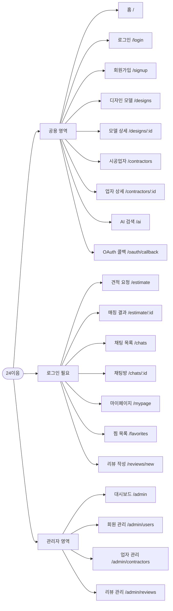
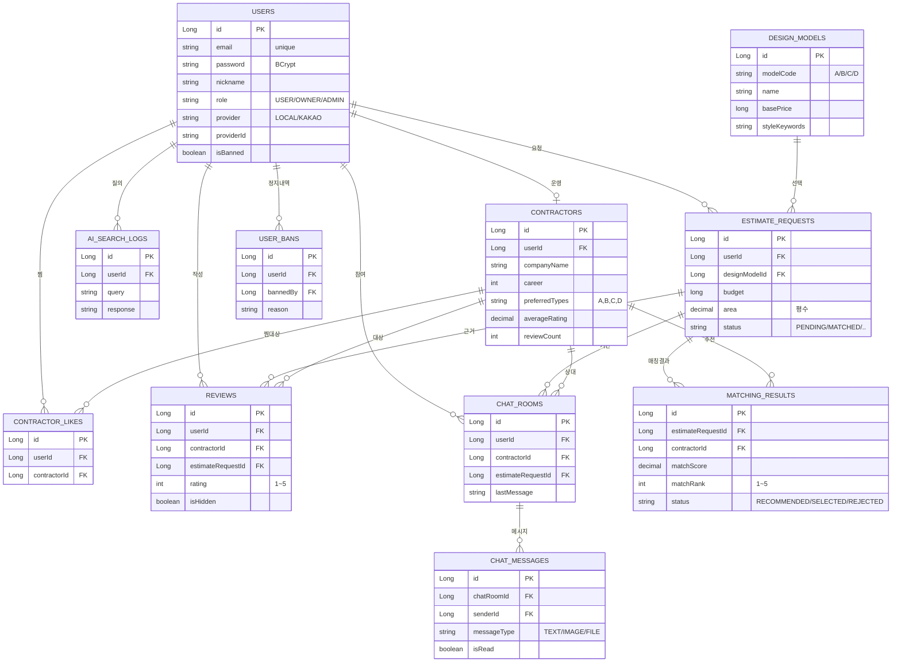

# **프로젝트 : 24이음 (24eum) - 인테리어 자재 & 업자 매칭 플랫폼** 🏠

> 인테리어 디자인 모델을 선택하고, 예산과 면적에 맞는 **시공업자를 자동 매칭**해주는 플랫폼
> 
> AI 검색(MCP)과 실시간 1:1 채팅으로 사용자와 시공업자를 연결

<br>

---

## 📋 목차
- [1. 프로젝트 개요](#1-프로젝트-개요)
- [2. 프로젝트 구조](#2-프로젝트-구조)
- [3. 개발자](#3-개발자)
- [4. 기술 스택](#4-기술-스택)
- [5. 프로젝트 수행 경과](#5-프로젝트-수행-경과)
- [6. 핵심 기능 코드 리뷰](#6-핵심-기능-코드-리뷰)
- [7. 화면 UI](#7-화면-ui)
- [8. 개발 환경 설정 가이드](#8-개발-환경-설정-가이드)
- [9. 자체 평가 의견](#9-자체-평가-의견)

---

<br>

## 1. 프로젝트 개요

### 1-1. 프로젝트 주제
- 인테리어 디자인 모델 선택 & 시공업자 매칭 플랫폼 **"24이음"**

### 1-2. 주제 선정 배경
- 인테리어 시공 시 업자 선정의 어려움 (가격 비교, 신뢰성 검증)
- 디자인 선택부터 시공업자 매칭까지 원스톱 서비스의 필요성
- 비대면 상담 수요 증가에 따른 실시간 채팅 기능 필요

### 1-3. 기획 의도
- 디자인 모델(A/B/C/D)을 선택하고 예산·면적을 입력하면 최적의 시공업자 Top 5를 자동 매칭
- AI 검색(MCP)을 통한 지능형 인테리어 정보 검색
- 1:1 실시간 채팅으로 사용자와 시공업자 간 직접 소통

### 1-4. 기대효과
- 인테리어 시공업자 선택의 투명성 및 편의성 향상
- AI 기반 맞춤형 검색으로 사용자 만족도 증대
- 찜/리뷰/평점 시스템으로 신뢰할 수 있는 업자 정보 제공

<br>

---

## 2. 프로젝트 구조

### 2-1. 주요 기능
| 구분 | 기능 |
|:---:|:---|
| 👤 사용자 | 회원가입 / 로그인 (JWT 토큰 인증) / 카카오 소셜 로그인 |
| 🎨 디자인 모델 | A/B/C/D 디자인 모델 선택 / 상세 조회 |
| 💰 견적 요청 | 예산 입력 / 면적(평수) 입력 / 견적 요청서 작성 |
| 🔧 업자 매칭 | DB 기반 시공업자 Top 5 자동 매칭 / 업자 상세 조회 |
| 💬 1:1 채팅 | WebSocket(STOMP + SockJS) 기반 실시간 채팅 (JSON) |
| 🤖 AI 검색 | MCP 기반 인테리어 관련 AI 검색 |
| ❤️ 찜 / 평점 | 시공업자 찜(좋아요) / 리뷰 평점 등록 |
| 👤 마이페이지 | 내 정보 수정 / 찜 목록 / 요청 내역 조회 |
| 🛡️ 관리자 | 회원 관리 / 업자 관리 / 리뷰 관리 / 대시보드 |

### 2-2. 메뉴 구조도
<details>
  <summary>메뉴 구조도 펼치기</summary>



> 📌 `RequireAuth` 가드(`frontend/src/routes.tsx`)가 로그인이 필요한 페이지 진입을 제어합니다. 비로그인 시 `/login`으로 리다이렉트되고, 로그인 후 원래 경로로 돌아옵니다.
</details>

<br>

---

## 3. 개발자

| 이름 | 담당 업무 |
|:---:|:---|
| **최영우** | • 프로젝트 전체 기획·설계·구현 및 일정 관리<br>• 로그인/회원가입 및 JWT 인증 (Spring Security)<br>• 카카오 소셜 로그인 (OAuth 2.0)<br>• 디자인 모델 선택 및 견적 요청 기능<br>• 시공업자 매칭 알고리즘<br>• 1:1 실시간 채팅 (WebSocket / STOMP)<br>• 찜/리뷰/평점 기능<br>• 관리자 페이지<br>• AI 검색 (MCP / OpenAI 연동)<br>• DB 설계 및 관리<br>• 프론트엔드 UI 구현 (React + Tailwind CSS, 반응형 레이아웃)<br>• 깃허브 저장소 관리 |

> 💡 형태 : **개인 프로젝트 (1인)** &nbsp;|&nbsp; 기간 : **2026.04 ~ 2026.XX**

<br>

---

## 4. 기술 스택

### Frontend
<div align="left">
  
  
  
  
  
  
  
</div>

### Backend
<div align="left">
  
  
  
  
  
  
  
</div>

### Database
<div align="left">
  
</div>

### API / Service
<div align="left">
  
  
  
</div>

### Tools
<div align="left">
  
  
  
  
  
</div>

### Architecture
```
backend/                              ← Spring Boot 백엔드 (REST API)
├── src/main/java/com/aloha/_24eum/
│   ├── config/                       ← Security, WebSocket, MyBatis 설정
│   ├── controller/                   ← REST API 컨트롤러
│   ├── dao/                          ← MyBatis Mapper 인터페이스
│   ├── dto/                          ← 데이터 전송 객체
│   ├── security/                     ← JWT 인증 필터 & 토큰 유틸
│   │   └── oauth/                    ← OAuth2 소셜 로그인 (카카오)
│   └── service/                      ← 비즈니스 로직 (Interface + Impl)
├── src/main/resources/
│   ├── mybatis/mapper/               ← SQL 매퍼 XML
│   └── application.properties        ← JWT 시크릿, DB 설정
└── uploads/                          ← 업로드 파일 저장소

frontend/                            ← React 프론트엔드 (Vite + TypeScript)
├── src/
│   ├── api/                          ← Axios API 호출 모듈
│   ├── components/                   ← 공통 UI 컴포넌트
│   │   ├── header/                   ← 헤더
│   │   ├── footer/                   ← 푸터
│   │   ├── ui/                       ← 공통 UI (Button, Input)
│   │   ├── modal/                    ← 모달
│   │   └── common/                   ← 공용 컴포넌트 (Loading 등)
│   ├── contexts/                     ← AppContext (JWT 인증 상태 관리)
│   ├── pages/                        ← 페이지별 컴포넌트
│   │   ├── Home/                     ← 메인 홈
│   │   ├── login/                    ← 로그인
│   │   ├── signup/                   ← 회원가입
│   │   ├── design/                   ← 디자인 모델 (목록/상세)
│   │   ├── estimate/                 ← 견적 요청 (폼/결과)
│   │   ├── contractor/               ← 시공업자 (목록/상세)
│   │   ├── chat/                     ← 1:1 채팅 (목록/채팅방)
│   │   ├── ai/                       ← AI 검색
│   │   ├── mypage/                   ← 마이페이지
│   │   ├── favorites/                ← 찜 목록
│   │   ├── review/                   ← 리뷰 작성
│   │   ├── admin/                    ← 관리자 페이지
│   │   └── error/                    ← 에러 페이지
│   ├── layouts/                      ← 레이아웃 (Main, Admin)
│   ├── styles/                       ← 스타일 (Tailwind CSS)
│   ├── routes.tsx                    ← React Router 라우팅 설정
│   └── App.tsx                       ← 앱 진입점
├── package.json                      ← 의존성 관리
└── vite.config.ts                    ← Vite 빌드 설정 (프록시)
```

<br>

---

## 5. 프로젝트 수행 경과

### 5-1. 요구사항 & 기능 정의서
<details>
  <summary>요구사항 및 기능 정의서 펼치기</summary>

| 영역 | 기능 ID | 기능명 | 설명 | 권한 |
|:---:|:---:|:---|:---|:---:|
| **인증** | F-AUTH-01 | 회원가입 | 이메일/비밀번호 기반 가입 (BCrypt 해시) | 공용 |
| | F-AUTH-02 | 로그인 | JWT 액세스/리프레시 토큰 발급 | 공용 |
| | F-AUTH-03 | 카카오 로그인 | OAuth2 인가코드 → JWT 발급 후 프론트 콜백 | 공용 |
| | F-AUTH-04 | 토큰 갱신 | refresh 토큰으로 access 재발급 | 로그인 |
| **디자인** | F-DSGN-01 | 모델 목록 | A/B/C/D 디자인 모델 카드 그리드 조회 | 공용 |
| | F-DSGN-02 | 모델 상세 | 썸네일/상세 이미지/기본가/스타일 키워드 조회 | 공용 |
| **견적** | F-EST-01 | 견적 요청 | 디자인 모델 + 예산 + 면적(평) + 주소 + 요구사항 입력 | 로그인 |
| | F-EST-02 | 매칭 결과 | 점수 상위 5명 시공업자 자동 추천 | 로그인 |
| | F-EST-03 | 내 요청 내역 | 마이페이지에서 과거 견적 조회 | 로그인 |
| **시공업자** | F-CTR-01 | 업자 목록 | 검색/카테고리 필터 | 공용 |
| | F-CTR-02 | 업자 상세 | 경력/자격증/포트폴리오/평균 별점 | 공용 |
| **상호작용** | F-LIKE-01 | 찜 / 찜 해제 | 토글 방식, 찜 목록 페이지 제공 | 로그인 |
| | F-REV-01 | 리뷰 작성 | 1~5점 별점 + 본문 + 이미지(JSON) | 로그인 |
| | F-REV-02 | 리뷰 숨김 | 관리자 신고 처리 | 관리자 |
| **채팅** | F-CHAT-01 | 채팅방 생성 | (사용자, 업자, 견적) 조합으로 멱등 생성 | 로그인 |
| | F-CHAT-02 | 실시간 메시지 | STOMP+SockJS, `/topic/chat.{roomId}` 구독 | 로그인 |
| | F-CHAT-03 | 안 읽음 카운트 | 채팅 목록 진입 시 읽음 처리 | 로그인 |
| **AI 검색** | F-AI-01 | 자연어 질문 | OpenAI 호출, 시스템 프롬프트로 도메인 한정 | 공용 |
| | F-AI-02 | 검색 로그 | 사용자별 질의/응답 기록 | 로그인 |
| **관리자** | F-ADM-01 | 회원/업자 관리 | 정지(BAN), 해제, 사유 기록 | 관리자 |
| | F-ADM-02 | 대시보드 | 회원 수/요청 수/리뷰 수 집계 | 관리자 |

</details>

### 5-2. ERD
<details>
  <summary>ERD 펼치기</summary>

> 💡 정의 원본: `backend/src/main/resources/schema.sql` (실제 컬럼 기준)



</details>

<br>

---

## 6. 핵심 기능 코드 리뷰

### 6-1. JWT 인증 & 카카오 소셜 로그인
> Spring Security + JWT 토큰 기반 Stateless 인증 + 카카오 소셜 로그인

<details>
  <summary>코드 보기</summary>

**① JWT 발급/검증 핵심 — `JwtProvider.java`**
```java
private String buildToken(User user, long expirationMillis, String type) {
    Date now = new Date();
    return Jwts.builder()
            .subject(String.valueOf(user.getId()))
            .claim("email", user.getEmail())
            .claim("role", user.getRole())
            .claim("nickname", user.getNickname())
            .claim("type", type)
            .issuedAt(now)
            .expiration(new Date(now.getTime() + expirationMillis))
            .signWith(key, Jwts.SIG.HS256)
            .compact();
}

public boolean validate(String token) {
    try { parse(token); return true; }
    catch (Exception e) { log.debug("JWT 검증 실패: {}", e.getMessage()); return false; }
}
```

**② 모든 요청 1회 통과 인증 필터 — `JwtAuthenticationFilter.java`**
```java
@Override
protected void doFilterInternal(HttpServletRequest request,
                                HttpServletResponse response,
                                FilterChain filterChain) throws ServletException, IOException {
    try {
        String token = resolveToken(request); // "Bearer xxx"
        if (StringUtils.hasText(token) && jwtProvider.validate(token)) {
            Long userId = jwtProvider.getUserId(token);
            UserDetails userDetails = userDetailsService.loadUserById(userId);
            var auth = new UsernamePasswordAuthenticationToken(
                    userDetails, null, userDetails.getAuthorities());
            SecurityContextHolder.getContext().setAuthentication(auth);
        }
    } catch (Exception e) {
        SecurityContextHolder.clearContext();
    }
    filterChain.doFilter(request, response);
}
```

**③ 카카오 로그인 성공 → JWT 발급 후 프론트 리다이렉트 — `OAuthSuccessHandler.java`**
```java
@Override
public void onAuthenticationSuccess(HttpServletRequest req, HttpServletResponse res,
                                    Authentication authentication) throws IOException {
    var custom = (CustomOAuth2UserService.CustomOAuth2User) authentication.getPrincipal();
    String access  = jwtProvider.createAccessToken(custom.details().getUser());
    String refresh = jwtProvider.createRefreshToken(custom.details().getUser());

    String target = frontendRedirectUri // 예: http://localhost:5173/oauth/callback
            + "?access="  + URLEncoder.encode(access,  StandardCharsets.UTF_8)
            + "&refresh=" + URLEncoder.encode(refresh, StandardCharsets.UTF_8);
    getRedirectStrategy().sendRedirect(req, res, target);
}
```

</details>

### 6-2. 시공업자 매칭 알고리즘
> 예산, 면적, 디자인 모델 기반 Top 5 시공업자 자동 매칭

<details>
  <summary>코드 보기</summary>

**점수식 (0 ~ 100점)**
- 선호 시공형태 일치 시 +35점 (`preferred_types`에 모델 코드 포함)
- 경력 1년당 +2점 (최대 30점)
- 평균 별점 × 5 (최대 25점)
- 리뷰 수 (최대 10점)

```java
private BigDecimal score(Contractor c, String designCode) {
    double s = 0;
    String prefer = c.getPreferredTypes() == null ? "" : c.getPreferredTypes().replace(" ", "");
    if (designCode != null && !designCode.isBlank()) {
        for (String p : prefer.split(",")) {
            if (p.equalsIgnoreCase(designCode)) { s += 35; break; }
        }
    }
    if (c.getCareer() != null)        s += Math.min(c.getCareer() * 2.0, 30);
    if (c.getAverageRating() != null) s += Math.min(c.getAverageRating().doubleValue() * 5.0, 25);
    if (c.getReviewCount() != null)   s += Math.min(c.getReviewCount(), 10);
    return BigDecimal.valueOf(s).setScale(2, RoundingMode.HALF_UP);
}

@Override
@Transactional
public List<MatchingResult> matchTop5(EstimateRequest req) {
    // 1. 디자인 모델 코드 조회 → 2. 후보 업자 풀 조회 → 3. 점수 계산
    String designCode = resolveDesignCode(req.getDesignModelId());
    List<Contractor> candidates = matchingMapper.findCandidates(designCode, req.getArea());

    // 4. 점수 내림차순 정렬 → 5. 기존 매칭 결과 삭제 후 상위 5명 저장
    var scored = candidates.stream()
            .map(c -> new Scored(c, score(c, designCode)))
            .sorted(Comparator.comparing(Scored::score).reversed())
            .limit(5).toList();

    matchingMapper.deleteByEstimate(req.getId());
    int rank = 1;
    List<MatchingResult> saved = new ArrayList<>();
    for (Scored s : scored) {
        MatchingResult mr = MatchingResult.builder()
                .estimateRequestId(req.getId())
                .contractorId(s.contractor().getId())
                .matchScore(s.score()).matchRank(rank++)
                .status("RECOMMENDED").build();
        matchingMapper.insert(mr);
        saved.add(mr);
    }
    return saved;
}
```

</details>

### 6-3. 1:1 실시간 채팅 (WebSocket)
> STOMP + SockJS 기반 실시간 채팅 (JSON 메시지 포맷)

<details>
  <summary>코드 보기</summary>

**① 서버 — STOMP 브로커 설정 (`WebSocketConfig.java`)**
```java
@Override
public void configureMessageBroker(MessageBrokerRegistry registry) {
    registry.enableSimpleBroker("/topic", "/queue");
    registry.setApplicationDestinationPrefixes("/app");
    registry.setUserDestinationPrefix("/user");
}

@Override
public void registerStompEndpoints(StompEndpointRegistry registry) {
    registry.addEndpoint("/ws")
            .setAllowedOriginPatterns("http://localhost:5173", "http://127.0.0.1:5173")
            .withSockJS();
}
```

**② 서버 — 메시지 수신 핸들러 (`ChatController.java`)**
```java
/** 클라이언트가 /app/chat.{roomId} 로 전송 → 서버가 /topic/chat.{roomId} 로 브로드캐스트 */
@MessageMapping("/chat.{roomId}")
public void onMessage(@DestinationVariable Long roomId, ChatMessage message) {
    message.setChatRoomId(roomId);
    chatService.send(message); // DB 저장 + 구독자에게 전송
}
```

**③ React 클라이언트 — STOMP 연결/구독/전송 (`ChatRoomPage.tsx`)**
```tsx
useEffect(() => {
  if (!roomId) return
  api.get<ChatMessage[]>(`/chat/rooms/${roomId}/messages`).then(({ data }) => setMessages(data))
  api.post(`/chat/rooms/${roomId}/read`).catch(() => {})

  const client = new Client({
    webSocketFactory: () => new SockJS('/ws'),
    reconnectDelay: 3000,
    onConnect: () => {
      client.subscribe(`/topic/chat.${roomId}`, (frame: IMessage) => {
        const msg = JSON.parse(frame.body) as ChatMessage
        setMessages((prev) => [...prev, msg])
      })
    },
  })
  client.activate()
  clientRef.current = client
  return () => { client.deactivate() }
}, [roomId])

const send = (e: FormEvent) => {
  e.preventDefault()
  if (!text.trim() || !me) return
  clientRef.current?.publish({
    destination: `/app/chat.${roomId}`,
    body: JSON.stringify({ chatRoomId: roomId, senderId: me.id, messageType: 'TEXT', content: text }),
  })
  setText('')
}
```

</details>

### 6-4. AI 검색 (MCP)
> OpenAI API 기반 MCP 인테리어 관련 AI 검색

<details>
  <summary>코드 보기</summary>

**① 도메인 한정 시스템 프롬프트 + 로그 적재 (`AiSearchServiceImpl.java`)**
```java
private static final String SYSTEM_PROMPT = """
        당신은 인테리어 매칭 플랫폼 '24이음'의 AI 어시스턴트입니다.
        사용자에게 인테리어 디자인/시공 자재/예상 견적/시공 시 주의사항을
        친절하고 구체적으로 한국어로 안내합니다.
        긴 응답은 마크다운 목록 형식으로 정리합니다.
        """;

@Override
@Transactional
public AiSearchResponse search(Long userId, String query) {
    if (query == null || query.isBlank())
        throw new IllegalArgumentException("질문을 입력해주세요.");

    String answer = openAi.chat(SYSTEM_PROMPT, query);

    logMapper.insert(AiSearchLog.builder()
            .userId(userId).query(query).response(answer).build());

    return AiSearchResponse.builder()
            .query(query).response(answer)
            .model(openAi.getModel())
            .createdAt(LocalDateTime.now()).build();
}
```

**② OpenAI Chat Completions 호출 (`OpenAiService.java`)**
```java
public String chat(String systemPrompt, String userPrompt) {
    if (!isConfigured()) throw new IllegalStateException("OpenAI API key 미설정");

    Map<String, Object> body = Map.of(
            "model", model,           // 기본: gpt-4o-mini
            "temperature", 0.7,
            "messages", List.of(
                    Map.of("role", "system", "content", systemPrompt),
                    Map.of("role", "user",   "content", userPrompt)));

    Map<String, Object> resp = client.post()
            .uri(apiUrl)
            .header(HttpHeaders.AUTHORIZATION, "Bearer " + apiKey)
            .contentType(MediaType.APPLICATION_JSON)
            .body(body).retrieve().body(Map.class);

    var choices = (List<Map<String, Object>>) resp.get("choices");
    var message = (Map<String, Object>) choices.get(0).get("message");
    return String.valueOf(message.get("content"));
}
```

</details>

<br>

---

## 7. 화면 UI

### 7-1. 메인 페이지
<!-- TODO: 메인 페이지 스크린샷 추가 -->

### 7-2. 디자인 모델 선택
<!-- TODO: 디자인 모델 선택 스크린샷 추가 -->

### 7-3. 견적 요청 & 업자 매칭
<!-- TODO: 견적 요청 및 매칭 결과 스크린샷 추가 -->

### 7-4. 1:1 채팅
<!-- TODO: 채팅 화면 스크린샷 추가 -->

### 7-5. AI 검색
<!-- TODO: AI 검색 화면 스크린샷 추가 -->

### 7-6. 관리자 페이지
<!-- TODO: 관리자 페이지 스크린샷 추가 -->

<br>

---

## 8. 개발 환경 설정 가이드

### 8-1. 사전 요구사항
| 항목 | 버전 | 비고 |
|:---:|:---:|:---|
| **JDK** | 23 | [Oracle JDK 23](https://www.oracle.com/java/technologies/downloads/#jdk23) |
| **Node.js** | 20 이상 (LTS 권장) | [Node.js 다운로드](https://nodejs.org/) |
| **MySQL** | 8.x | 스키마명: `24eum`, 포트: `3306` |
| **VS Code** | 최신 | Java Extension Pack, ES7+ React 확장 설치 권장 |

### 8-2. 프로젝트 클론
```bash
git clone <레포지토리 URL>
cd 24eum
```

### 8-3. 백엔드 설정 (Spring Boot)
```bash
cd backend
```

1. **시크릿 파일 생성**  
   `src/main/resources/application-secret.properties` 파일을 생성하고, 아래 내용을 본인 환경에 맞게 작성:
   ```properties
   # 카카오 소셜 로그인
   KAKAO_CLIENT_ID=<카카오 REST API 키>
   KAKAO_CLIENT_SECRET=<카카오 Client Secret>
   KAKAO_REDIRECT_URI=http://localhost:8080/login/oauth2/code/kakao
   ```
   > ⚠️ 이 파일은 `.gitignore`에 포함되어 있으므로 **직접 생성**해야 함.

2. **MySQL 데이터베이스 생성**
   ```sql
   CREATE DATABASE `24eum` DEFAULT CHARACTER SET utf8mb4 COLLATE utf8mb4_unicode_ci;
   ```

3. **백엔드 실행**
   ```bash
   # Windows
   .\gradlew.bat bootRun
   
   # Mac / Linux
   ./gradlew bootRun
   ```
   → `http://localhost:8080` 에서 백엔드 서버 실행 확인

### 8-4. 프론트엔드 설정 (React + Vite)
```bash
cd frontend
```

1. **의존성 설치**
   ```bash
   npm install
   ```

2. **개발 서버 실행**
   ```bash
   npm run dev
   ```
   → `http://localhost:5173` 에서 프론트엔드 개발 서버 실행 확인  
   → API 요청은 Vite 프록시를 통해 자동으로 `localhost:8080`으로 전달

### 8-5. 전체 실행 순서 요약
```
1. MySQL 실행 → 24eum DB 생성
2. backend/ → application-secret.properties 생성
3. backend/ → .\gradlew.bat bootRun
4. frontend/ → npm install → npm run dev
5. 브라우저에서 http://localhost:5173 접속
```

### 8-6. 주의사항
- `application-secret.properties`는 Git에 올라가지 않음 → **카카오 개발자 콘솔에서 키 값 직접 발급받아 작성**
- `backend/build/`, `backend/.gradle/`, `frontend/node_modules/`는 Git에 포함되지 않으며, 각자 환경에서 자동 생성됨
- Java 23이 설치되어 있는지 확인: `java --version`
- Node.js가 설치되어 있는지 확인: `node --version`

<br>

---

## 9. 자체 평가 의견

> 💡 아래는 현재 코드 구조 기준의 **초안**입니다. 필요 시 자유롭게 수정 / 보강 가능.

### 잘한 점
- **계층 분리가 일관됨** — `controller → service(Interface+Impl) → dao(MyBatis Mapper) → DTO` 4-Layer를 모든 도메인(채팅·매칭·리뷰·AI 등)에 동일하게 적용했다.
- **Stateless 인증 + 소셜 로그인을 한 토큰 체계로 통합** — 자체 로그인(`/auth/login`)과 카카오 OAuth2(`OAuthSuccessHandler`)가 모두 같은 `JwtProvider`로 access/refresh 쌍을 발급, 프론트 처리가 단순해졌다.
- **매칭 점수식이 명시적이고 테스트 가능** — `MatchingServiceImpl#score`가 35/30/25/10 가중치로 분리되어 있어 룰 변경/검증이 쉽다.
- **실시간 채팅을 가벼운 STOMP 브로커로 처리** — 외부 메시지 큐 없이 `enableSimpleBroker` + SockJS만으로 1:1 채팅 요건을 충족.
- **OpenAI 호출을 도메인 시스템 프롬프트로 한정** — 인테리어 외 질문이 들어와도 답변이 도메인에서 크게 벗어나지 않게 가드.

### 아쉬운 점
- **테스트 코드가 거의 없음** — 매칭 점수식, JWT 검증, 채팅 멱등 생성 등 단위 테스트가 가장 필요한 곳에 테스트가 없다.
- **API 명세 문서가 따로 없음** — Swagger/Springdoc 미적용으로, 프론트가 컨트롤러를 직접 읽어야 엔드포인트를 파악할 수 있다.
- **카카오 외 다른 소셜 로그인 확장 시 분기 코드 발생 가능** — `OAuth2UserInfoFactory` 패턴은 갖춰져 있으나 실제 구현은 카카오 하나뿐이라 검증되지 않았다.
- **채팅 메시지 페이지네이션이 단순** — `page/size` 방식이라 메시지가 누적되면 신규 메시지 도착 시 페이지 경계가 흔들릴 수 있다 (커서 기반 권장).
- **이미지 업로드 검증이 약함** — `uploads/` 경로 직접 노출 구조라 파일 타입/크기 검증, CDN 분리 등이 추가 필요.

### 개선할 점
- [ ] **OpenAPI(Swagger) 도입** — `springdoc-openapi-starter-webmvc-ui` 의존성 추가 후 `/swagger-ui.html` 노출.
- [ ] **WebSocket 인증** — 현재 `/ws` 엔드포인트는 origin만 체크. STOMP CONNECT 프레임에서 JWT를 검증하도록 `ChannelInterceptor` 추가.
- [ ] **매칭 알고리즘 가중치를 설정값으로 분리** — `application.properties`의 `matching.weight.*`로 외부화하면 A/B 테스트가 가능해진다.
- [ ] **리프레시 토큰 회전(rotation) + 블랙리스트** — 현재는 만료까지 무제한 사용 가능. Redis 기반 저장소 도입 검토.
- [ ] **프론트 상태관리** — `AppContext` 하나로 모든 상태를 들고 있는데, 채팅/매칭이 늘어나면 React Query 같은 서버 상태 라이브러리 분리가 필요.
- [ ] **CI** — GitHub Actions로 `./gradlew test` + `npm run build` 자동화.

<br>

---

> 📌 **24이음(24eum)** — 인테리어의 모든 과정을 이어주는 매칭 플랫폼
